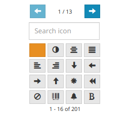
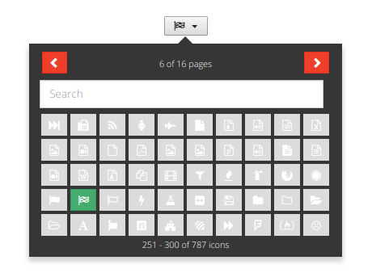

# BootStrap IconPicker

This package is a simple wrapper of [Victor's Bootstrap-IconPicker](http://victor-valencia.github.io/bootstrap-iconpicker/) for Meteor.

## Quick Start

1. Install the package:

```
meteor add luixal:bs-iconpicker
```

2. You can now add the icon picker like any other template:

```html
{{> bsIconpicker}}
```

Just with this, icon picker should appear in your template with default settings, just like this:




## Options

There are some options added by this package and the base ones hinherited from the original package. If you want to pass options, you can the set the template like this:

```html
{{> bsIconpicker options}}
```

and define a helper to return that options object with this format:

```javascript
'iconPickerOptions': function() {
    return {
      elementId: 'myID',
      renderAsButton: true,
      onChange: function(e) {console.log(e.icon)},
      options: {
        arrowClass: 'btn-danger',
        arrowPrevIconClass: 'glyphicon glyphicon-chevron-left',
        arrowNextIconClass: 'glyphicon glyphicon-chevron-right',
        cols: 10,
        footer: true,
        header: true,
        icon: 'fa-bomb',
        iconset: 'fontawesome',
        labelHeader: '{0} of {1} pages',
        labelFooter: '{0} - {1} of {2} icons',
        placement: 'bottom',
        rows: 5,
        search: true,
        searchText: 'Search',
        selectedClass: 'btn-success',
        unselectedClass: ''
      }
    }
  }
```

You should see something like this:



Here you can see the options provided by the Meteor package:

* `elementId`: custom ID for the html element. Useful in case you want to show different iconPicker at the same time and do some stuff with them. Takes a `String` value.
* `renderAsButton`: allows you to render it as a button that shows the iconPicker when clicked (true) or as a plain icon picker with no button to trigget it (false or not set).
* `onChange`: a function called when an icon is selected. Receives one param containing the triggered event. Icon value is in `event.icon` in a `String` format.

And how the options defined in the original package as passed, as documented [here](http://victor-valencia.github.io/bootstrap-iconpicker/),inside the `options` param.
